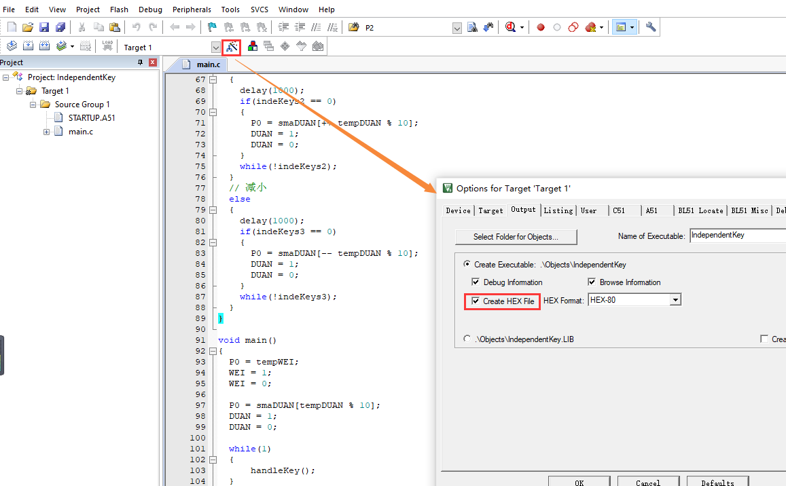
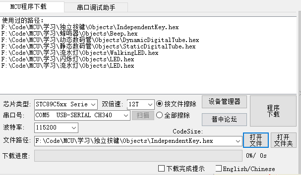

## 51单片机入门学习常见代码

### 简介

这个仓库收录了一些51单片机的学习过程中的练习代码

> **开发板电路图**请在项目根目录下的PDF文件中查看
>
> **型号**是`STC89C52`
>
> 新建项目的时候选择Microchip AT89C52， 写代码时头文件选择reg51.h或者reg52.h都能用

### 使用

用keil打开项目文件，然后在如下图所示，勾选Create Hex

按下F7进行编译，如果编译成功，那么将在项目根目录下的Objects文件夹中生成一个**hex文件**

然后打开一个能用的ISP烧录软件——如果没有的话可以使用仓库中提供的这个

点击程序下载即可进行烧录

> **这里有几个常见的导致烧录失败的原因**
>
> 1. 使用的开发板是热烧录的，需要开机才能进行下载——但是并没有开机
> 2. 没有安装相应的串口驱动（图上显示的CH340就是一种安装了驱动的标识）
> 3. 安装了驱动但是由于数据线甚至开发板损坏等硬件损坏导致下载失败——甚至无法识别串口
> 4. 没有选择正确的芯片类型

如果下载成功并且开发板上出现了对应的现象，那么恭喜，你已经迈出了硬件开发的第一步！继续前进，新的世界在等着你！

### 问题反馈

如果遇到bug，欢迎一起探讨，可以在issues中进行反馈
