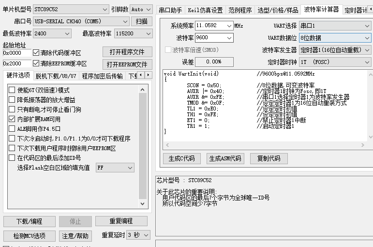
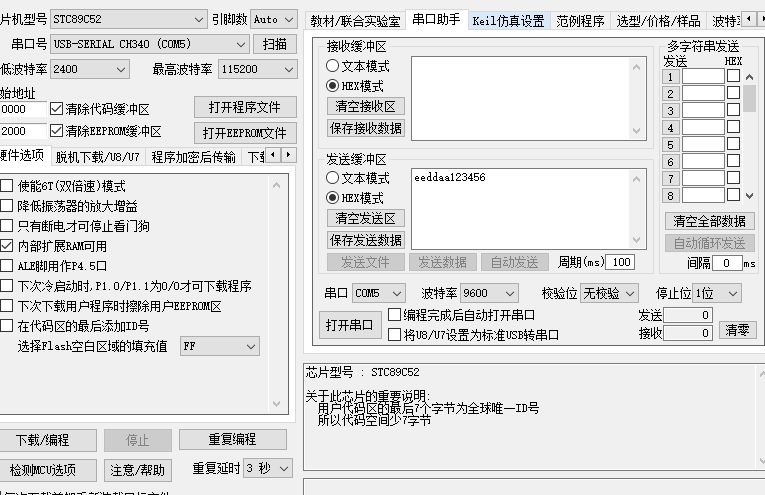

## 51单片机入门学习常见代码

### 简介

大一上的时候就接触过单片机，但是大部分的时间都用于学习前端开发的相关知识，一直到大二下有了一门单片机的课程才终于下定决心进行了一些系统的学习

>按照前端的定义——**直接和用户交互的程序部分**，那么单片机也可以被纳入大前端的范畴😁

学习的过程中也因为数字逻辑、数字电路方面知识的匮乏遇到了一些阻碍，但是整个学习的过程还是非常有意思的，其中很多精妙的设计令我赞叹不已，相信这也能让打算学习单片机的初学者们感到无比兴奋

这个仓库收录了一些本人学习51单片机过程中的练习代码，欢迎指正~

> **开发板电路图**请在项目根目录下的PDF文件中查看
>
> **芯片型号**是`STC89C52`
>
> 新建项目的时候选择`Microchip AT89C52`， 编写代码时头文件选择`reg51.h`或者`reg52.h`均可

### 基本使用

用keil打开项目文件，然后在如下图所示，勾选`Create Hex`

按下F7进行编译，如果编译成功，那么将在项目根目录下的Objects文件夹中生成一个**hex文件**

然后打开一个能用的ISP烧录软件——如果没有的话可以使用仓库中提供的这个

> 
该ISP软件与本人无关，仅供学习使用

不论哪个ISP，最简单的使用方式都是一样的，只需要以下几个步骤:

> 0. 用数据线将 开发板 和  PC链接 (如果使用的开发板是热烧录的，还要打开开发板电源)
> 1. 选择数据线所连接的串口号（这里可以通过几次拔插观察串口号的变化来确定具体串口号）
> 2. 选择芯片类型，这里使用的是`STC89C52`
> 3. 选择要烧录的文件，选中之前生成的hex文件
> 4. 点击程序下载等待下载完成即可

**这里有几个常见的导致烧录失败的原因**

> 1. 使用的开发板是热烧录的，需要开机才能进行下载——但是并没有开机
> 2. 没有安装相应的串口驱动（图上显示的CH340就是一种安装了驱动的标识）
> 3. 安装了驱动但是由于数据线甚至开发板损坏等硬件损坏导致下载失败——甚至无法识别串口
> 4. 没有选择正确的芯片类型

如果下载成功并且开发板上出现了对应的现象，那么恭喜，你已经迈出了硬件开发的第一步！继续前进，新的世界在等着你！

### 辅助工具

本仓库中提供了一个ISP烧录软件，但是除了烧录之外，它还能有很多别的功能，比如定`时器计算器`、`波特率计算器`、`串口通信助手`等等

当然，其计算结果与实际情况有时会有一定出入，主要是在于其自动生成的部分代码可能并没有对应的硬件结构——这取决于开发板本身的构造，当遇到这种问题时，删掉提示报错的部分代码即可

> 再次重申，该ISP烧录软件仅供学习使用，并非由本人开发

### 问题反馈

如果遇到bug，欢迎一起探讨，可以在issues中进行反馈

